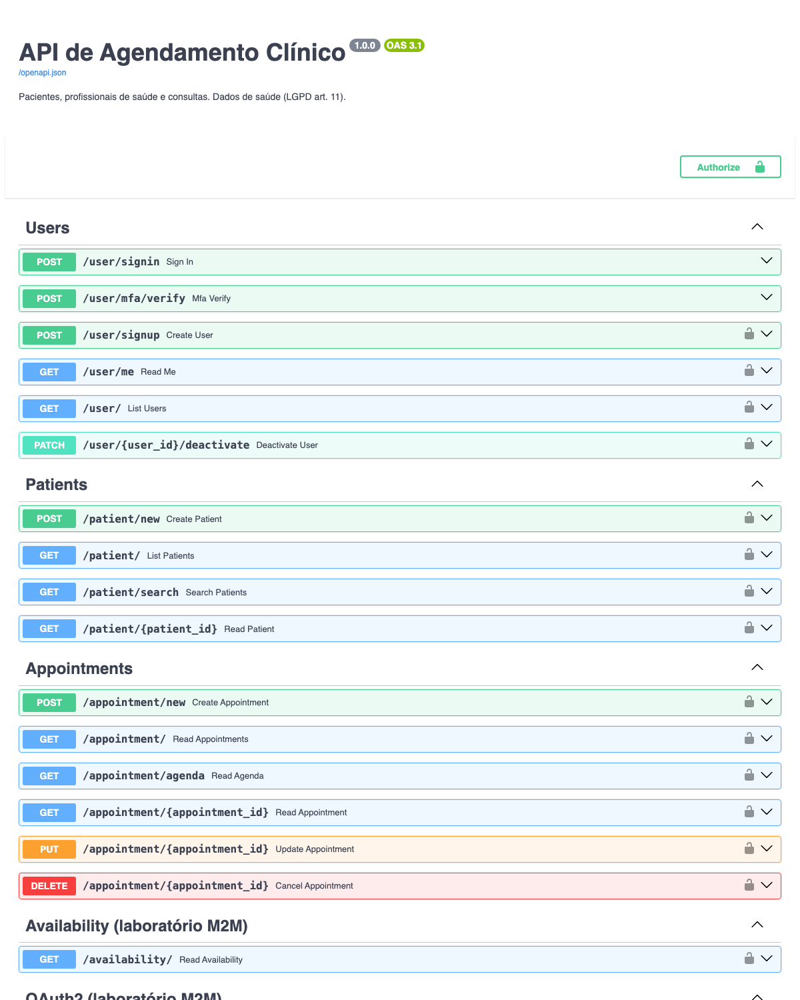
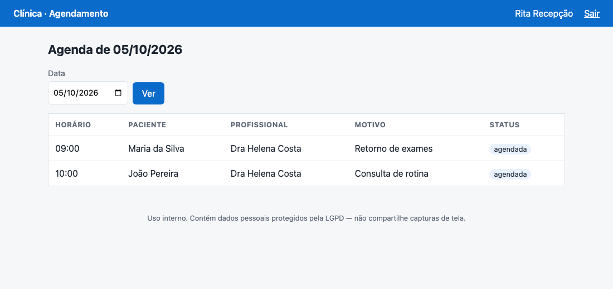
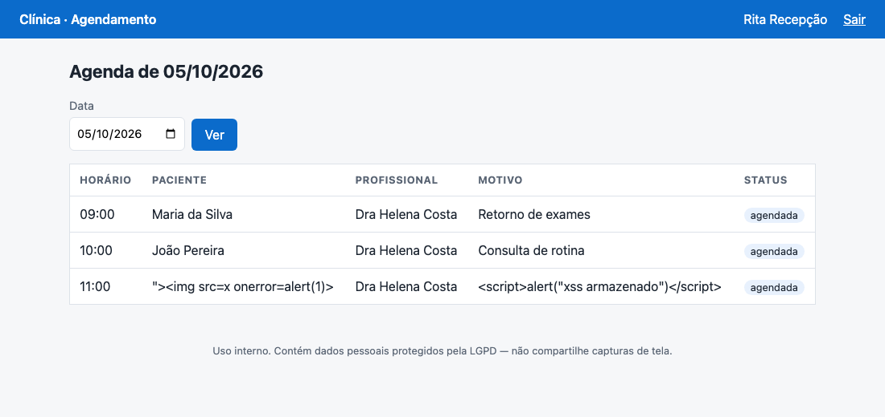
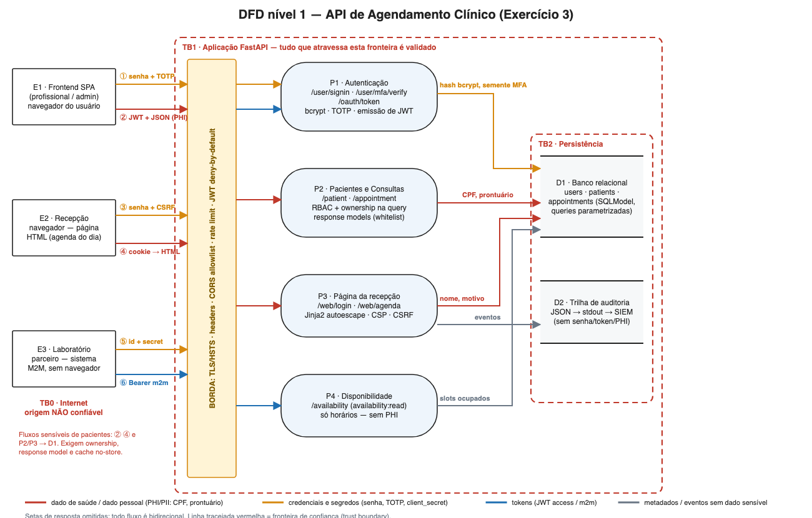
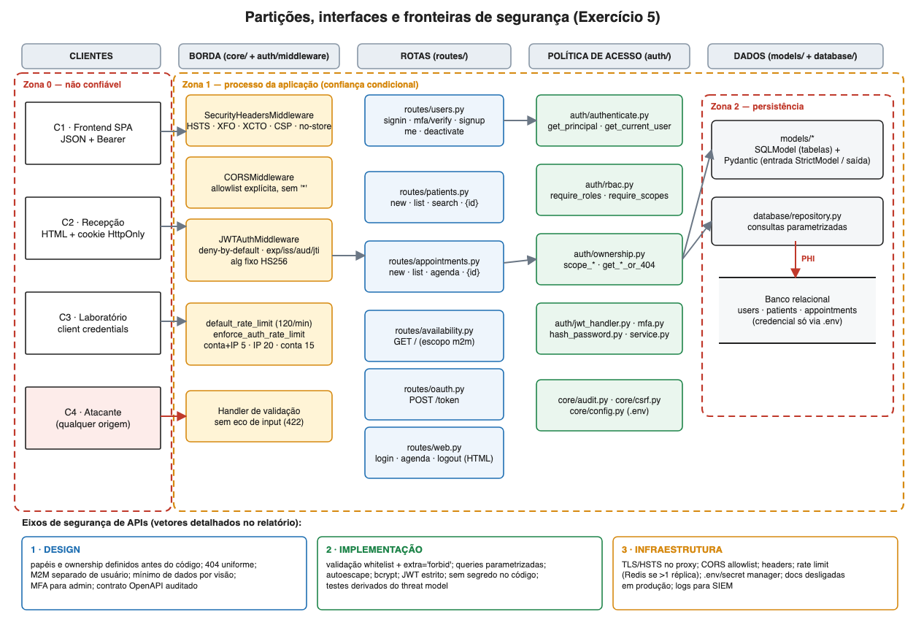
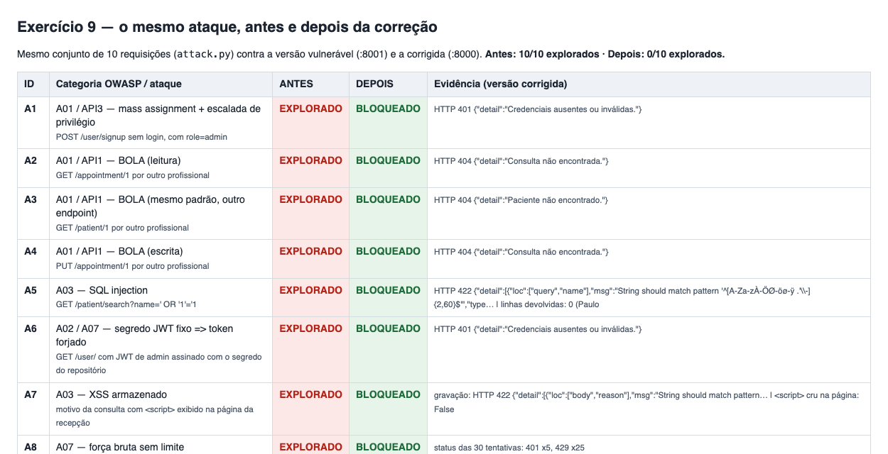

# Relatório Técnico — API de Agendamento Clínico

**Disciplina:** Desenvolvimento Seguro de Aplicações Web · Prof. Fabiano Domingues · Engenharia de Computação (Infnet)  
**Entrega:** Assessment DR2 · AT  
**Aluno:** José Augusto Nascimento  
**Vídeo de apresentação (YouTube, não listado):** `https://youtu.be/<COLOQUE-O-LINK-AQUI>`  
**Repositório (GitHub):** <https://github.com/joseaugustorosa/repo_at_dev>  
**Pasta da entrega (Google Drive):** <https://drive.google.com/drive/folders/1Rd5TseE5pK02Be37Nml3IpVy_p2W_FUy?usp=sharing>  

> **Como ler este relatório.** Cada exercício tem: *decisão*, *justificativa*, *onde está no código* e *evidência* (arquivo em `evidence/` ou teste em `tests/`). Todos os números abaixo vêm de execuções reais, reproduzíveis com `bash scripts/collect_evidence.sh` (e `scripts/run_zap_passive.sh` para o ZAP). Itens da rubrica × onde estão demonstrados: Anexo G. O que ainda depende de uma etapa externa (a execução do workflow no GitHub) está marcado como **PENDENTE** no item 12.4 — nada foi inventado.

## Resumo executivo

| | |
|---|---|
| **O que é** | API FastAPI para agendamento de consultas: pacientes, profissionais e consultas, com 3 tipos de cliente (frontend JSON, página HTML da recepção, laboratório parceiro M2M) e 3 papéis (admin, recepcionista, profissional). Trata **dado de saúde** (LGPD art. 11). |
| **Stack** | Python 3.13 · FastAPI 0.142 · Pydantic 2 · SQLModel 0.0.47 · PyJWT · bcrypt · Jinja2 · pytest |
| **Antes × depois (Ex. 8/9)** | O mesmo conjunto de 10 ataques: **10/10 explorados** na versão vulnerável → **0/10** na versão corrigida (`evidence/ex08_ex09_antes_depois/`) |
| **Testes** | **197 testes automatizados passando** · cobertura **96 %** do código da aplicação · 25 ameaças do threat model ligadas a 53 verificações de teste (`docs/matriz_ameaca_teste.md`) |
| **SAST / SCA** | Bandit (≥ MEDIUM): sem achados · pip-audit: **0 vulnerabilidades** nas dependências finais — contra **25 vulnerabilidades em 5 pacotes** nas dependências fixadas pelo Starter Kit |
| **Auditoria OpenAPI** | 12 verificações, 0 falhas (`docs/ex13_openapi_audit.md`) |
| **OWASP ZAP (scan passivo real)** | 4 scans (baseline `/`, baseline `/web/login`, API como recepcionista, API como profissional): **0 alertas bloqueantes**. O 1º scan achou **1 achado real** (90004, COEP ausente, Baixo) → corrigido → 2º scan sem o achado (item 13.4) |
| **Decisão de deploy (Ex. 13)** | **GO condicional** — 7 condições (item 13.6) |

**Estrutura da entrega**

```
clinica-api-assessment/
├── main.py                 # app, middlewares, registro de routers
├── routes/                 # APIRouter por recurso: users, patients, appointments, availability, oauth, web
├── models/                 # tabelas SQLModel + schemas Pydantic (entrada StrictModel / saída whitelist)
├── database/               # engine, sessão por DI, consultas parametrizadas (repository.py)
├── auth/                   # camada de autenticação/autorização separada (jwt, mfa, middleware, rbac, ownership)
├── core/                   # config (BaseSettings), headers, rate limit, auditoria, CSRF
├── templates/ static/      # Jinja2 com herança (base → login/agenda)
├── tests/                  # 197 testes (um arquivo por exercício) + matriz ameaça→teste
├── scripts/                # bootstrap_env, seed, e2e_demo, cvss, audit_openapi, gates, coleta de evidências
├── .github/workflows/      # security-pipeline.yml (security gate)
├── docs/                   # threat model, pipeline, CVSS, auditoria OpenAPI, risco residual, roteiro do vídeo
└── evidence/               # evidências por exercício (prints, payloads, saídas de scan)
```

---

## Exercício 1 — Fundação da API

**Decisão.** Ambiente virtual isolado (`python3.13 -m venv .venv`), dependências fixadas em `requirements.txt` e aplicação nascida **já modularizada** (`routes/`, `models/`, `database/`, mais `auth/` e `core/`), com um `APIRouter` por recurso e `include_router` registrado em um único lugar (`main.py::ROUTERS`).

**Justificativa.**
* O enunciado pede evitar o retrabalho de "dezenas de rotas num arquivo só": cada recurso (usuários, pacientes, consultas, disponibilidade, OAuth, web) é um módulo; a política de acesso vive em `auth/` e **não é copiada** entre módulos (`require_roles`, `require_scopes` e `get_*_or_404` são o único ponto de decisão).
* **Desvios conscientes do Starter Kit** (que fixava FastAPI 0.77, Pydantic 1.10, `python-jose` e Python 3.10/3.11):
  1. versões atuais e corrigidas — o `pip-audit` das dependências do kit acusa **25 vulnerabilidades em 5 pacotes** (ex.: CVE-2024-24762, ReDoS em FastAPI/`python-multipart`; CVE-2024-33663, confusão de algoritmo no `python-jose`) — `evidence/ex12_pipeline/pip_audit_antes.txt`;
  2. `PyJWT` no lugar de `python-jose` (o próprio repositório da disciplina já usa `PyJWT` em `events-api-sql`);
  3. rotas síncronas (`def`) em vez de `async def` com `Session` síncrona — o kit bloqueava o *event loop* a cada consulta ao banco, um risco de disponibilidade (A04);
  4. `lifespan` no lugar de `@app.on_event`, que é *deprecated*.
* O teste `tests/test_ex01_appointments.py` cobre o caminho de sucesso do recurso `consultas` (criar e listar), conforme pedido, e é o primeiro arquivo de uma suíte que cresce por exercício (`test_ex02…`, `test_ex06…`, …).

**Evidência.** `evidence/ex01_fundacao/` (`pytest_ex01.txt`, `pip_freeze_venv.txt`, `swagger_docs.png`).



---

## Exercício 2 — Exposição de dados e templates seguros

**Decisão 1 — response models com whitelist.** A tabela `Appointment` tem campos de auditoria interna (`created_by_user_id`, `created_at`, `updated_at`, `created_from_ip`, `internal_audit_note`). Nenhuma rota devolve a tabela: todas declaram `response_model` com **lista explícita de campos** (`AppointmentPublic`, `AgendaItem`, `PatientPublic`, `UserPublic`, `AvailabilityResponse`). É whitelist, não blacklist: um campo novo na tabela **não vaza** até alguém declará-lo na saída.

* Além disso: CPF sai **mascarado** (`***.***.***-25`); `password_hash`, `mfa_seed` e demais campos de segredo nunca aparecem em schema de resposta (verificado também no contrato OpenAPI, check O-06).
* Cada perfil recebe a **menor visão** possível: a recepção recebe `AgendaItem` (sem CPF, telefone, anotações clínicas); o laboratório recebe só horários livres.

**Decisão 2 — página HTML com Jinja2 e herança** (`templates/base.html` → `login.html`, `agenda.html`), `autoescape` **ligado** por `select_autoescape`, nenhum `|safe`. Em profundidade:
1. **Entrada**: texto livre passa por whitelist/regex (sem `< > & { } \`);
2. **Saída**: autoescape do Jinja2 neutraliza mesmo dados já persistidos (legados);
3. **Navegador**: CSP `default-src 'none'; style-src 'self'` — sem nenhum script, nem inline;
4. **Sessão**: cookie `HttpOnly; SameSite=Strict`, formulários com token CSRF.

**O risco de não declarar `response_model` (justificativa técnica).** Sem `response_model` de saída — ou com `response_model` apontando para a própria tabela, como no Starter Kit, o que filtra exatamente nada — o FastAPI serializa **tudo que a função devolve**: ao retornar o objeto da tabela, vão para o cliente *todas* as colunas — inclusive as que ninguém decidiu expor. Isso causa quatro problemas:
1. **Vazamento imediato**: campos de auditoria (`created_from_ip`, `internal_audit_note`), identificadores internos e, em outras entidades, `password_hash` ou CPF completo passam a fazer parte do contrato público (OWASP API3:2023 *Broken Object Property Level Authorization* / *Excessive Data Exposure*; CWE-213 e CWE-200). Em dado de saúde, vira dado pessoal exposto sem finalidade (LGPD art. 6º, III — necessidade).
2. **Vazamento futuro e silencioso**: com *blacklist* ou sem filtro, toda coluna **nova** da tabela passa a vazar no deploy seguinte, sem que ninguém revise — o risco cresce com o tempo. Com *whitelist* o campo novo fica de fora até alguém declará-lo na saída.
3. **Facilita outros ataques**: nomes de campos e IPs internos mapeiam a regra de negócio e a infraestrutura para o atacante, e combinados com BOLA entregam o prontuário inteiro.
4. **Não é detectável em revisão de rota**: o código "funciona"; a falha só aparece olhando a resposta — por isso a auditoria do OpenAPI (check O-06) e os testes de resposta passaram a verificar os campos de saída.

Prova com o **mesmo registro** (`evidence/ex02_templates_xss/sem_vs_com_response_model.txt`), versão sem `response_model` dedicado × com `response_model` dedicado:

<!-- include-code: evidence/ex02_templates_xss/sem_vs_com_response_model.txt -->

**Onde.** `models/appointments.py` (`AppointmentPublic`, `AgendaItem`), `models/patients.py` (máscara), `routes/web.py`, `templates/`, `core/security_headers.py`.

**Evidência.** `tests/test_ex02_response_models_xss.py` (11 testes), inclusive o que **grava um `<script>` direto no banco** e prova que a página o exibe como texto; e um teste que falha se algum template usar `|safe`.

| Dados normais | Payload XSS **persistido no banco** (exibido como texto inerte) |
|---|---|
|  |  |

---

## Exercício 3 — Fundamentos de segurança e modelagem inicial

### 3.1 Tríade CIA aplicada à aplicação

| Pilar | Ativo / risco principal | Controles implementados (onde) | Lacuna assumida |
|---|---|---|---|
| **Confidencialidade** *(peso regulatório: LGPD art. 11)* | Prontuário, CPF, telefone, agenda; credenciais; segredos | JWT + MFA admin (`auth/`) · RBAC + **ownership dentro da query** (`auth/ownership.py`) · response models com whitelist · CPF mascarado · `Cache-Control: no-store` · bcrypt · segredos só em `.env` · logs sem PII/tokens | CPF em texto claro **no banco** (sem criptografia de coluna) → R-01 |
| **Integridade** | Prontuário, status de consulta, papéis | `extra='forbid'` (anti mass assignment) · whitelist/regex · queries parametrizadas · JWT assinado (HS256 fixo, `iss/aud/exp/jti`) · CSRF · índice único de horário · cancelamento lógico · trilha de auditoria | Auditoria em stdout, não imutável → R-06 |
| **Disponibilidade** | Agendamento em horário de funcionamento; integração do laboratório | rate limit em 2 níveis · paginação com teto · rotas `def` (não bloqueiam o event loop) · validação barata antes de bcrypt · deny-by-default | Limitador em memória; tamanho de corpo depende do proxy; SQLite → R-02, R-08, R-09 |

### 3.2 Frameworks de referência × controles já implementados

| Framework | Item | Controle concreto no projeto | Evidência |
|---|---|---|---|
| **OWASP Top 10:2021** | A01 Broken Access Control | `auth/rbac.py`, `auth/ownership.py`, middleware deny-by-default | `test_ex06`, `test_ex09::test_bola_*`, `test_ex12::test_deny_by_default_*` |
| | A02 Cryptographic Failures | bcrypt, segredo JWT ≥ 32 chars via `.env`, HSTS, CPF mascarado | `test_ex11`, `test_ex10` |
| | A03 Injection (SQL/XSS) | SQLModel parametrizado, whitelist, Jinja2 autoescape, CSP | `test_ex09`, `test_ex02` |
| | A04 Insecure Design | threat model antes das correções; 404 uniforme; M2M separado de usuário | `docs/ex04_threat_model.md` |
| | A05 Security Misconfiguration | CORS allowlist, headers, docs desligadas em produção, `--no-server-header` | `test_ex10`, `test_ex11::test_producao_exige_endurecimento` |
| | A06 Vulnerable Components | versões atualizadas; `pip-audit` + Trivy no CI | `evidence/ex12_pipeline/pip_audit_*.txt` |
| | A07 Identification & Auth Failures | rate limit, MFA, mensagem genérica, tempo constante | `test_ex06`, `test_ex10`, `test_ex12` |
| | A09 Logging & Monitoring | `core/audit.py` (JSON, sem segredos) | `test_ex12::test_*_trilha_de_auditoria` |
| **OWASP API Top 10:2023** | API1 BOLA · API2 Broken Auth · API3 BOPLA/Excessive Data · API4 Resource Consumption · API5 BFLA · API8 Misconfig | ownership; JWT/MFA; response models + `extra='forbid'`; paginação + rate limit; `require_roles`; headers/CORS | idem; auditoria OpenAPI |
| **NIST SSDF (SP 800-218)** | PW.1 / PW.2 projetar e revisar com modelo de ameaças | `docs/ex04_threat_model.md` | — |
| | PW.4 reutilizar software seguro e mantido | `PyJWT` em vez de `python-jose`; bcrypt direto (sem `passlib`, cuja última versão, 1.7.4, é de 2020) | `requirements.txt` |
| | PW.5 / PW.6 práticas de código seguro e configuração | `StrictModel`, `Settings` com validadores, `bandit` | `core/config.py` |
| | PW.7 / PW.8 revisar e **testar** o código | SAST, 197 testes, auditoria OpenAPI, ZAP | `.github/workflows/` |
| | PS.1 / PS.2 proteger o código e as entregas | *Actions* fixadas por **SHA**, `permissions: contents: read`, `.env` fora do ZIP | `test_ex12_ci_gate` |
| | RV.1 / RV.2 identificar, priorizar e corrigir vulnerabilidades | pip-audit/Trivy, CVSS + impacto de negócio | `docs/cvss_priorizacao.md` |
| **MITRE ATT&CK** | T1110 / T1110.004 Brute Force / Credential Stuffing | rate limit 3 baldes, MFA admin | `test_ex12::test_credential_stuffing_*` |
| | T1078 Valid Accounts · T1528 Steal Application Access Token | TTL curto, `aud`/`token_use`, escopos, desativar conta corta o acesso | `test_ex06`, `test_ex07` |
| | T1190 Exploit Public-Facing Application | validação + parametrização + deny-by-default | `test_ex09` |
| | T1539 Steal Web Session Cookie | cookie `HttpOnly`, `SameSite=Strict`, CSP sem script | `test_ex02` |
| | T1552.001 Credentials in Files | segredos só em `.env`; Trivy `secret`; guarda de teste | `test_ex11` |
| **MITRE CWE** | CWE-639 (IDOR/BOLA) · CWE-915 (mass assignment) · CWE-89 (SQLi) · CWE-79 (XSS) · CWE-798 (credencial fixa) · CWE-352 (CSRF) | os controles acima | `evidence/ex08_ex09_antes_depois/` |

### 3.3 DFD básico com fronteiras de confiança



**Trust boundaries.** **TB0** — Internet/dispositivos (não confiável). **TB1** — a aplicação: tudo que a cruza passa pela *camada de borda* (TLS/HSTS, headers, CORS, rate limit, JWT deny-by-default) e por validação de schema. **TB2** — persistência: só alcançada por consultas parametrizadas, com credencial vinda do `.env`.

**Fluxos de dados sensíveis (pacientes):** ② JWT + JSON de pacientes/consultas (saída) e ④ HTML da agenda (saída); P2/P3 → D1 (gravação de CPF, telefone, prontuário, nome e motivo). São os fluxos que exigem *ownership*, *response model*, `no-store` e escape. Credenciais (①, ③, ⑤) e hash/semente MFA (P1 → D1) são o segundo grupo crítico.

---

## Exercício 4 — Modelagem de ameaças com STRIDE

O modelo completo — ativos, superfícies de ataque, misuse cases, STRIDE por componente, DREAD e árvore de ataque — está em **`docs/ex04_threat_model.md`**. Resumo:

* **9 misuse cases** (MU-01…MU-09), no formato das aulas 8/9 (ator, objetivo, caminho do atacante, resposta do sistema): BOLA de prontuário, cadastro com `role=admin`, força bruta, XSS armazenado na agenda, SQL injection, abuso do token do laboratório, endpoint esquecido sem proteção, conta admin sem 2º fator, repúdio de cancelamento.
* **STRIDE aplicado a 5 componentes** (o enunciado pede 3): C1 Autenticação · C2 Consultas · C3 Página da recepção · C4 Integração do laboratório · C5 Persistência — **25 ameaças** com ID (`T-S1`…`T-X2`).
* **DREAD** (escala 0–10 da aula 9) para priorizar: lideram `T-T1` mass assignment de `role` (9,2), `T-S1` JWT forjado (8,8) e `T-I2` BOLA de leitura (8,4).
* **Rastreabilidade:** cada ameaça aponta para controles e testes em `tests/threat_matrix.py`; o teste `test_matriz_de_ameacas_aponta_apenas_para_testes_existentes` falha se a matriz citar teste inexistente.

---

## Exercício 5 — Arquitetura de segurança e vetores de ataque



**Partições** (cada uma esconde detalhes atrás de uma interface — aula 10): *Clientes* → *Borda* (`core/` + `auth/middleware.py`) → *Rotas* (`routes/`) → *Política de acesso* (`auth/`) → *Dados* (`models/` + `database/`). Três zonas de confiança: **Zona 0** (clientes e atacantes), **Zona 1** (processo da aplicação, confiança condicional) e **Zona 2** (persistência).

**Fluxo de uma requisição** (padrão do projeto, mesma sequência em todas as rotas):
1. TLS/HSTS no proxy → 2. `SecurityHeaders` → 3. `CORS` → 4. `JWTAuthMiddleware` (token válido? `iss/aud/exp/jti`, `token_use`) → 5. rate limit → 6. validação do corpo (`StrictModel`) → 7. `require_roles`/`require_scopes` (**papel** pode chamar a operação?) → 8. `get_*_or_404` (**este registro** pertence ao chamador?) → 9. query parametrizada → 10. `response_model` (só os campos permitidos) → 11. evento de auditoria.

**Vetores de ataque nos 3 eixos de segurança de APIs** (detalhe e status em `docs/ex04_threat_model.md`, seção 6):

| Eixo | Vetores relevantes | Mitigação | Residual |
|---|---|---|---|
| **1. Design** | autorização só por papel (BOLA) · token de máquina servindo como token de usuário · operação "esquecida" sem proteção · excesso de dados por visão · enumeração de IDs | papel **+** dono na query · `token_use` + escopos · deny-by-default · 1 `response_model` por visão · 404 uniforme | decisão 404×403 reduz diagnóstico para o cliente legítimo |
| **2. Implementação** | injeção (SQL/XSS) · mass assignment · JWT forjado/`alg=none` · erro que ecoa entrada · CSRF · timing de login | parametrização, whitelist, autoescape · `extra='forbid'` · JWT estrito · handler de 422 sem `input` · token CSRF · hash "dummy" | regex de nomes rejeita caracteres raros (usabilidade) |
| **3. Infraestrutura** | CORS curinga · ausência de HSTS/XFO/XCTO · força bruta/DoS · segredo no repositório · dependência vulnerável · documentação exposta | allowlist · headers · 3 baldes de rate limit · `.env` + Trivy/`secret` · pip-audit · `ENABLE_DOCS=false` em produção | limitador em memória (1 réplica); TLS e tamanho de corpo no proxy |

---

## Exercício 6 — Autenticação e autorização

**Decisão.** `OAuth2PasswordBearer` + `POST /user/signin` (formulário OAuth2); senhas com **bcrypt** (custo 12; rotinas `HashPassword.create_hash/verify_hash`); **JWT** HS256 com expiração (30 min), `iss`, `aud`, `nbf`, `iat`, `jti` obrigatórios e algoritmo **fixo**; **MFA TOTP simulado** obrigatório para `admin`; autorização **RBAC + ownership**.

**MFA (simulado).** O algoritmo é o TOTP real (RFC 6238, compatível com Google Authenticator); "simulado" porque não há tela de QR Code nem recuperação. O banco guarda só uma *semente aleatória*; o segredo TOTP é derivado por HMAC com `MFA_MASTER_KEY` (fora do banco) — um *dump* do banco, sozinho, não gera códigos. Anti-replay: o último passo de 30 s aceito é gravado. Fluxo do admin: `signin` devolve só um `mfa_token` (válido 5 min, inútil como credencial de API); `POST /user/mfa/verify` troca token + código por um *access token*.

**RBAC × ABAC × autorização por recurso — por que um híbrido.**

| Modelo | Responde | Ponto forte | Ponto fraco neste sistema |
|---|---|---|---|
| RBAC puro | "este **papel** pode chamar a operação?" | simples, auditável, cabe no token | **não impede BOLA**: dois profissionais têm o mesmo papel e o ID da URL é livre |
| ABAC puro | "estes **atributos** permitem?" | flexível | regras espalhadas, difíceis de auditar e testar para só 3 papéis |
| Por recurso (ownership) | "**este registro** é seu?" | resolve BOLA | sozinho não restringe as *operações* por papel |
| **Adotado: RBAC nas rotas + ownership por atributo de dono, aplicado dentro do `WHERE`** | os dois | simples **e** seguro; política em 2 módulos (`auth/rbac.py`, `auth/ownership.py`) | exige disciplina: toda rota por ID usa `get_*_or_404` (garantido por testes) |

**Política (conforme o enunciado: apenas profissionais criam e gerenciam consultas dos próprios pacientes):**

| Operação | admin | recepcionista | profissional |
|---|---|---|---|
| Criar/listar usuários, desativar conta | ✔ (com MFA) | ✘ | ✘ |
| Cadastrar paciente | ✔ | ✔ (indica o profissional responsável) | ✔ só para si |
| Ver paciente | ✔ todos | ✔ todos (CPF mascarado) | ✔ só os próprios |
| **Criar/alterar consulta** | ✘ | ✘ | ✔ **só para pacientes próprios** (`professional_id` vem do token) |
| Ler consulta (prontuário) / cancelar | ✔ todas | ✘ | ✔ só as próprias |
| Agenda do dia (sem dados clínicos) | ✔ | ✔ | ✔ só a própria |

> O Starter Kit permitia que a recepção criasse consultas e proibia o profissional (`test_medico_nao_pode_criar_consulta`). O enunciado do Ex. 6 diz o contrário ("apenas profissionais … criem e gerenciem consultas dos próprios pacientes"); segui o **enunciado**. A política está em uma tabela de atalhos (`auth/rbac.py`) e mudá-la é trocar uma linha.

**Sessão segura.** *Stateless* por JWT, mas `get_current_user` consulta o banco a cada chamada: desativar a conta ou mudar o papel invalida o token **imediatamente**. Cookie da página web: `HttpOnly`, `SameSite=Strict`, `Secure` (obrigatório em produção, por validador de `Settings`).

**Teste pedido no enunciado:** `tests/test_ex06_authz.py::test_usuario_sem_papel_admin_nao_acessa_rota_restrita_a_admin` — recepcionista e profissional recebem **403** em `GET /user/` e `POST /user/signup`. A mesma suíte cobre token expirado, assinatura errada, `alg=none`, outra audiência, papel adulterado, MFA e *replay*.

**Evidência.** `evidence/ex06_autenticacao_autorizacao/pytest_ex06.txt` (21 testes, inclui MFA pela página web) · `evidence/ex13_capstone/e2e_demo.txt` (passos 2–7).

---

## Exercício 7 — Escopos e integração externa (laboratório)

**Fluxo escolhido: OAuth 2.0 *Client Credentials* (RFC 6749 §4.4).**

| Fluxo | Serve? | Por quê |
|---|---|---|
| Authorization Code + PKCE | ✘ | exige usuário e navegador — o laboratório é um **sistema**; PKCE protege cliente público agindo por uma pessoa |
| Password (ROPC) | ✘ | o laboratório teria de guardar senha de pessoa; removido no OAuth 2.1 |
| Device Code | ✘ | para dispositivos sem teclado |
| **Client Credentials** | ✔ | máquina-a-máquina, sem consentimento, sem *refresh token* |

**Escopo e claims — o contrato "tecnicamente garantido":**

| | Usuário (profissional) | Laboratório |
|---|---|---|
| `token_use` | `access` | `m2m` |
| `sub` | id do usuário | `laboratorio-parceiro` |
| papel | `role` (e conferido no banco) | **sem `role`** |
| escopo | — | `availability:read` |
| TTL | 30 min | **10 min** |
| acessa | rotas de usuário (por papel + ownership) | **somente** `GET /availability/` |

**Se o token do laboratório vazar:** só serve para consultar horários livres (sem dado de paciente); expira em 10 min; `403` em qualquer rota de usuário (`token_use` ≠ `access`); pedir escopo fora do contrato devolve `invalid_scope`; o segredo do cliente só existe como **hash bcrypt** no `.env`; tentativas são limitadas e auditadas. Em produção o papel do servidor de autorização seria de um IdP (Keycloak, aula 15, com *service account*); o emissor mínimo de `routes/oauth.py` mantém a entrega autocontida com o mesmo contrato (grant, escopos, claims). Endurecimento futuro: mTLS ou `private_key_jwt` (R-07).

**Evidência.** `evidence/ex07_m2m_escopos/fluxo_client_credentials_curl.txt` (token, claims decodificadas, 403 nas rotas de usuário, `invalid_scope`, `invalid_client`) · `pytest_ex07.txt` (16 testes) · o OpenAPI documenta o esquema `clientCredentials` com o escopo.

---

## Exercício 8 — Identificação de vulnerabilidades (leitura de código)

Método: leitura do código do Starter Kit e da versão pré-hardening (sem scanner) e, para cada hipótese, uma prova de exploração (`evidence/ex08_ex09_antes_depois/attack.py`). A reconstrução da versão pré-hardening (`vulnerable_baseline/app.py`) parte dos defeitos reais do kit e acrescenta os padrões que o enunciado manda procurar.

| # | Categoria OWASP | Onde (arquivo:linha) | Padrão vulnerável | Prova |
|---|---|---|---|---|
| 1 | **A01 / API1 — BOLA** (obrigatório) | baseline `app.py:170-171` `read_appointment` (e `app.py:147-148` `read_patient`); kit `routes/appointments.py:32` lista **todas** as consultas | `session.get(Appointment, id)` sem teste de dono: trocar o ID na URL devolve o prontuário de outro | A2 (leitura), A4 (escrita) |
| 2 | **A01 / API3 — mass assignment + escalada** | kit `routes/users.py:12`, `models/users.py:9` | a **tabela** `User` é o corpo do cadastro público: `{"role":"admin"}` vira admin | A1 |
| 3 | **A02 / A07 — segredo fixo e JWT frouxo** | kit `auth/jwt_handler.py:5,10,23` | segredo no repositório (→ forjar token de admin), claim `expires` própria, `except:` genérico, sem `iss/aud` | A6 |
| 4 | **A03 — SQL injection** | baseline `app.py:142` | `f"SELECT … LIKE '%{name}%'"` (mesmo padrão do `github-actions/sast/app.py` da aula) | A5 |
| 5 | **A03 — XSS armazenado** | baseline `app.py:192` | `{{ a.reason \| safe }}` desliga o autoescape | A7 |
| 6 | **API3 — exposição excessiva** | kit `routes/appointments.py:14,27`, `routes/patients.py:15,26` | `response_model=<tabela>` devolve campos internos e CPF completo | A9 |
| 7 | **A07 — força bruta** | kit `routes/users.py:23` | login sem limite de tentativas | A8 |
| 8 | **A05 — misconfiguration** | baseline `app.py:90` | CORS `*` + credenciais, sem HSTS/XFO/XCTO | A10 |
| 9 | **A06 — componentes vulneráveis** | kit `requirements.txt` | 25 vulnerabilidades em 5 pacotes (pip-audit) | `pip_audit_antes.txt` |

**Observação que fundamentou o gate do Ex. 12:** das 9 linhas, o SAST (Bandit) enxerga **uma** (a SQL injection) e só com `-ll`; o critério do exemplo da aula (`-lll`, só HIGH) **não detectaria nada** (`evidence/ex12_pipeline/bandit_antes.txt`). BOLA, mass assignment e XSS por `|safe` dependem de contexto de negócio — por isso exigem *testes de autorização* e DAST, não só scanner.

**Sobre o cenário "paciente autentica e lê o prontuário de outro".** O sistema tem três papéis (não há papel "paciente"); modelei o mesmo defeito entre dois profissionais — a classe de falha (BOLA, CWE-639) e a correção são idênticas.

---

## Exercício 9 — Correção das vulnerabilidades de entrada e saída

| Falha (Ex. 8) | Correção centralizada | Onde |
|---|---|---|
| BOLA (1) | `scope_appointments` / `scope_patients` aplicam o dono **dentro do `WHERE`**; `get_*_or_404` devolve 404 igual para "não existe" e "não é seu" (sem enumeração) e audita a tentativa | `auth/ownership.py` |
| Mass assignment (2) | Corpo é `StrictModel` com `extra='forbid'`; papel é `Enum`; `professional_id` nunca vem do cliente; cadastro de usuário só por admin | `models/base.py`, `models/*.py`, `routes/users.py` |
| JWT (3) | Segredo via `BaseSettings`; HS256 fixo; `iss/aud/exp/nbf/iat/jti` obrigatórios; decodificação única no **middleware JWT centralizado, deny-by-default** | `auth/jwt_handler.py`, `auth/middleware.py` |
| SQLi (4) | `select().where()` parametrizado; termo validado por **whitelist** (`^[A-Za-zÀ-ÿ .'\-]{2,60}$`); `LIKE` com `autoescape` | `database/repository.py`, `models/base.py` |
| XSS (5) | Whitelist de caracteres na entrada **+** autoescape do Jinja2 na saída **+** CSP sem script | `models/base.py`, `templates/`, `core/security_headers.py` |
| Exposição (6) | `response_model` whitelist; CPF mascarado | `models/*.py` |

**Endpoint não citado no Ex. 8 com o mesmo padrão (exigido):** `GET /patient/{id}` (e `PUT`/`DELETE /appointment/{id}`). O Ex. 8 cita a leitura de consulta; os demais compartilham o padrão "buscar por ID sem conferir o dono" e passam pelo **mesmo** `get_*_or_404` — um teste percorre todos (`test_ex09::test_bola_em_todos_os_endpoints_por_id`).

**Evidência de antes e depois** — o *mesmo* ataque (`attack.py`) contra as duas versões:



Saídas brutas: `resultado_antes.txt` (**10/10 explorados**) e `resultado_depois.txt` (**0/10**). Um achado honesto: o payload `x' UNION SELECT cpf FROM patients --` **passa** pela whitelist (só tem letras, espaço, apóstrofo e hífen) — quem o neutraliza é a **parametrização**, e há teste para cada camada (`test_busca_com_payload_sql_e_barrada_pela_whitelist` e `test_payload_que_passa_na_whitelist_e_neutralizado_pela_parametrizacao`). Defesa em profundidade, não uma regra só.

**Por que um middleware + dependências, e não só uma coisa.** O middleware resolve *quem é* (e dá o deny-by-default para endpoints novos); as dependências resolvem *o que pode* (papel, escopo, dono). O teste `test_deny_by_default_em_todas_as_rotas` percorre todas as rotas registradas sem token; abrir uma rota exige editar a allowlist `PUBLIC_PATHS`, que fica visível no *code review* (e é fixada por outro teste).

---

## Exercício 10 — Hardening de rede e proteção contra abuso

* **CORS com allowlist explícita** (`CORS_ALLOWED_ORIGINS`, lista JSON no `.env`). `Settings` **recusa** `"*"` e origens sem esquema; `allow_credentials=False` (o frontend usa Bearer, não cookie *cross-site*); métodos e cabeçalhos também listados.
* **Cabeçalhos de segurança** em *toda* resposta, inclusive 401/422/429 (o middleware de headers é o mais externo): **HSTS** (`max-age=63072000; includeSubDomains`), **X-Frame-Options: DENY**, **X-Content-Type-Options: nosniff**, mais CSP restritiva, `Referrer-Policy`, `Permissions-Policy`, **COOP/COEP/CORP** e `Cache-Control: no-store` (o COEP entrou depois do primeiro scan do ZAP — item 13.4). A CSP é mais frouxa só para `/docs` (precisa do CDN do Swagger) — e a documentação é **desligada em produção** por validador.
* **Rate limit diferenciado.** Padrão: 120 req/min por IP. **Login / MFA / token M2M**, em três baldes independentes:

| Balde | Limite | Para quê |
|---|---|---|
| conta + IP | 5/min | força bruta a partir de uma origem |
| IP | 20/min | *credential stuffing* (muitas contas, um IP) sem punir uma recepção atrás do mesmo NAT |
| conta (qualquer IP) | 15/min | teto para força bruta distribuída |

> Ajustes feitos por falhas que o desenvolvimento revelou: (1) um limite só por IP bloqueava a recepção inteira; (2) um limite só por conta deixaria **um atacante travar o login de qualquer usuário** (DoS por bloqueio). A chave composta *conta+IP* resolve os dois, e há teste para cada caso (`test_atacante_nao_consegue_travar_o_login_do_usuario_legitimo_em_outro_ip`).

**Limitações.** HSTS só tem efeito sobre HTTPS (TLS termina no proxy); o contador é em memória do processo (R-02).

**Evidência.** `evidence/ex10_hardening/` — `headers_cors_curl.txt`, `rate_limit_login_curl.txt` (5 × 401, depois 429 com `Retry-After`) e `pytest_ex10.txt` (17 testes).

---

## Exercício 11 — Persistência segura

* **SQLModel** (tabelas) com **toda consulta parametrizada** (`select().where()`); nenhuma concatenação — protegido por um teste que varre o código por padrões de SQL montado por texto e por um teste que compila uma consulta com payload e mostra o valor como **parâmetro ligado**.
* **Sessão por injeção de dependência** (`Depends(get_session)`); um teste troca a dependência por outro banco e prova que as rotas a usam.
* **Credenciais fora do código.** `core/config.py` (`BaseSettings`) lê `.env`; os campos sensíveis **não têm valor padrão** — sem `.env` a aplicação não sobe (*fail closed*). Validadores: chave JWT ≥ 32 caracteres, só HS256, CORS sem curinga, e em produção bcrypt ≥ 12, `Secure` ligado e `/docs` desligado. `SecretStr` evita vazar segredo em `repr`/logs. A entrega leva só `.env.example` (placeholders), e o `.env` real está no `.gitignore`.
* **Integridade no banco.** `UNIQUE` em e-mail e CPF; **índice único parcial** impede dois horários ativos do mesmo profissional (cancelada libera o horário); `IntegrityError` vira 409.
* O Starter Kit já usava SQLModel/SQLite; a "migração" aqui é tornar a camada **configurável e segura**: trocar de SQLite para PostgreSQL é mudar `DATABASE_URL` (e adicionar migrações Alembic — ver R-09).

**Evidência.** `tests/test_ex11_persistence.py` (11 testes) · `.env.example`.

---

## Exercício 12 — Pipeline DevSecOps e auditoria automatizada

Documento completo: **`docs/ex12_pipeline_devsecops.md`**. Arquivo do pipeline: `.github/workflows/security-pipeline.yml` (cópia em `evidence/ex12_pipeline/`).

### 12.1 Em que fase do SDLC cada tipo de ferramenta atua — e por quê

| Tipo | Ferramenta | Fase | Bloqueia? | Justificativa (ligada ao histórico de vulnerabilidades) |
|---|---|---|---|---|
| **Segredos** | Trivy `secret` | commit/PR | sim (qualquer) | F-02: segredo JWT fixo no repositório foi P0; descoberto tarde, o segredo já está no histórico do git |
| **SAST** (estática) | Bandit `-ll` | PR (segundos) | MEDIUM ou maior | F-03: SQL injection por f-string. Barato, determinístico, roda sem aplicação. **`-lll` não a pegaria** (prova no item 12.2) |
| **SCA** (dependências) | Trivy `vuln` + pip-audit | PR **e** semanal | HIGH/CRITICAL e qualquer CVE com correção | F-08: o kit trazia 25 CVEs. CVE nasce sem commit → o agendamento semanal é indispensável |
| **Testes de segurança** (pytest) | suíte derivada do threat model | PR | **qualquer falha** | F-01/04/05/06 (BOLA, mass assignment) **não são vistos por scanner**: dependem de regra de negócio |
| **DAST passivo** | OWASP ZAP baseline + API (`-S`) | após subir o app (PR/main) | regras `FAIL` ou risco ≥ Médio | F-09/F-11: headers, CORS, cookies, CSRF só existem com a aplicação rodando |
| **DAST ativo/autenticado** | ZAP em **staging** | pré-release (manual/semanal) | revisão humana | ataca de verdade (fuzz, injeção): nunca em produção, nunca com dado real de paciente |
| **IAST** (interativa) | agente instrumentado (ex.: Contrast, Datadog IAST) | QA/staging, durante a suíte de integração | — | enxerga fluxo de dado até a query dentro da aplicação; precisa de agente e carga de testes. **Lacuna assumida:** sem agente neste projeto — compensada pelos testes de autorização + ZAP autenticado |

### 12.2 Critério do security gate (decidido e justificado)

**Bloqueia o merge** quando houver: (1) **qualquer teste de segurança falhando** (tolerância zero — são os que cobrem a classe de falha que scanners não veem); (2) **segredo detectado**; (3) **SAST ≥ MEDIUM**; (4) **SCA: HIGH/CRITICAL (Trivy) ou qualquer CVE com correção disponível (pip-audit)**; (5) **DAST: regra marcada `FAIL` em `.zap/rules.tsv` ou risco ≥ Médio**. Achados abaixo disso geram relatório, não bloqueio.

Em termos de CVSS: **score ≥ 7,0 sempre bloqueia**; **4,0–6,9 bloqueia quando afeta confidencialidade de dado de saúde** (impacto de negócio 4) — o que é garantido por testes, já que nenhuma ferramenta calcula impacto de negócio sozinha; **< 4,0** é registrado.

**Por que esse limiar, e não o do exemplo da aula (HIGH apenas):** rodei o Bandit nas duas versões. Com `-lll` a versão vulnerável **passa** (exit 0); com `-ll` é **bloqueada** pela SQL injection (B608 é *Medium*). Em dado de saúde, uma injeção de SQL é catastrófica mesmo sendo "Medium" para o scanner — por isso o corte em MEDIUM (`evidence/ex12_pipeline/bandit_antes.txt`). O gate também **se testa**: o job `gate-regression` falha se o Bandit deixar a versão vulnerável passar.

### 12.3 Priorização: CVSS + impacto de negócio

Tabela completa (11 vulnerabilidades, vetor CVSS 3.1, score calculado por `scripts/cvss.py` — validado contra scores de referência por testes —, impacto de negócio 1–4 e prioridade P0–P3) em **`docs/cvss_priorizacao.md`**, incluída no Anexo A. Destaque: a **BOLA de leitura tem CVSS 6,5 ("Média") mas é P1** — vazar prontuário de terceiro é fato gerador de notificação à ANPD (LGPD art. 48); o CVSS sozinho a subestimaria.

### 12.4 Security gate em GitHub Actions

`security-pipeline.yml`: jobs `sast`, `sca-and-secrets`, `tests`, `gate-regression`, `dast-passive` e `security-gate` (o único check obrigatório no *branch protection*; só libera se **todos** terminarem em `success` — `skipped` bloqueia, lógica testada em `scripts/ci_gate.py`). Boas práticas aplicadas: *Actions* fixadas por **SHA de commit** (o exemplo da aula usava `trivy-action@master`, mutável — risco de cadeia de suprimentos; há teste que reprova qualquer *action* não fixada), `permissions: contents: read`, `concurrency`, execução semanal, segredos de teste gerados no próprio *runner*.

> **Honestidade sobre a execução.** Não tenho como executar o workflow no GitHub a partir deste ambiente. Validei a sintaxe (YAML), os SHAs (resolvidos pela API do GitHub) e **executei localmente os mesmos comandos** (`bash scripts/security_gate_local.sh` → `SECURITY GATE: LIBERADO`; saída em `evidence/ex12_pipeline/gate_local_saida.txt`; o ZAP real, em `evidence/ex13_capstone/zap/`). **PENDENTE:** a execução no Actions, o *print* do check `SECURITY GATE` verde e ligar o *branch protection* exigindo esse check — é ele que efetivamente impede o merge (README, "Checklist de entrega"). A sintaxe do cabeçalho `Authorization` para o ZAP dentro da *action* (`cmd_options`) não foi exercitada; localmente, com `docker run`, funcionou.

### 12.5 Testes de autorização expandidos a partir do threat model

O teste do Ex. 6 virou uma suíte organizada pelas ameaças do Ex. 4: `tests/test_ex12_threat_vectors.py` e a matriz `tests/threat_matrix.py` (25 ameaças → 53 verificações, todas verdes — `docs/matriz_ameaca_teste.md`). Cobrem, entre outros: deny-by-default em **todas** as rotas, JWT forjado/expirado/`alg=none`/outra audiência, BOLA em leitura/escrita/cancelamento, mass assignment, escalada de papel, token M2M × token de usuário, replay de MFA, trilha de auditoria, *credential stuffing* e anti-lockout.

**Evidência.** `evidence/ex12_pipeline/` (`bandit_antes/depois`, `pip_audit_antes/depois`, `gate_local_saida`, `security-pipeline.yml`, `pytest_ex12.txt`).

---

## Exercício 13 — Capstone: auditoria final e rastreabilidade

### 13.1 Aplicação final

Autenticação (bcrypt, JWT, MFA, deny-by-default), validação (`extra='forbid'`, whitelist), headers e CORS, persistência segura (SQLModel parametrizado, `.env`), M2M com escopo, página HTML segura e trilha de auditoria — tudo na mesma organização modular. Demonstração ponta a ponta: `python scripts/e2e_demo.py` (saída em `evidence/ex13_capstone/e2e_demo.txt`).

### 13.2 Testes automatizados com mocking (entrada e autorização)

`tests/test_ex13_unit_mocks.py` — 46 testes **unitários** que substituem as dependências com `unittest.mock`:
* **O teste inicial do Ex. 1, agora com mocks:** `TestEx01ComMocks` reexecuta o caminho de sucesso (criar e listar consulta) com **sessão simulada** (`MagicMock`), conferindo `add/commit/refresh`, o `professional_id` vindo do usuário e que a SQL gerada na listagem já filtra pelo dono e tem `LIMIT`;
* **Entrada:** schemas Pydantic isolados (extra proibido, regex, CPF, senha > 72 bytes, data passada/fora de bloco/com fuso, código MFA);
* **Autorização:** `require_roles` e `require_scopes` chamados diretamente com *users* simulados e `audit` espiado; `get_appointment_or_404` com **sessão simulada** (`MagicMock`) provando 404 + alarme de BOLA; a **rota** `create_appointment` chamada diretamente com sessão que lança `IntegrityError` (→ 409) e conferindo que o `professional_id` salvo é o do token;
* **Criptografia/tempo com relógio e bcrypt simulados:** expiração de JWT com `datetime` congelado, `verify_hash` tratando erro do bcrypt, usuário inexistente/inativo gastando o mesmo custo de hash, TOTP com janela e *replay*, *rate limiter* com relógio controlado.

Resultado da suíte completa: **197 passed**, cobertura **96 %** (`evidence/ex13_capstone/pytest_suite_completa_com_cobertura.txt`).

### 13.3 Auditoria da especificação OpenAPI

`python scripts/audit_openapi.py` (também roda como teste) — resultado em `docs/ex13_openapi_audit.md` e no Anexo C: **12 verificações, 0 falhas**. A auditoria **achou três lacunas reais que foram corrigidas**: `cpf` sem limite declarado; `user_id` sem mínimo; e o formulário de login do FastAPI (`OAuth2PasswordRequestForm`) sem `maxLength` — trocado por um formulário próprio, compatível com o botão *Authorize*. Também provei que os checks detectam o problema (testes que injetam um endpoint público esquecido, um corpo aberto e um campo interno em resposta).

### 13.4 Scan passivo do OWASP ZAP — executado e interpretado

**Como foi executado** (`bash scripts/run_zap_passive.sh`; saídas reais em `evidence/ex13_capstone/zap/`): OWASP ZAP **2.17.0** (imagem oficial `ghcr.io/zaproxy/zaproxy:stable`, digest `sha256:781a2bda…5081ef`) em Docker/Colima, contra a API local em `http://host.docker.internal:8000`, com `COOKIE_SECURE=true` (como em produção) e `/docs` ligado apenas para o ZAP importar o OpenAPI. **Quatro scans, todos passivos:**

| Scan | Como | URLs | Regras que rodaram sem alerta (`PASS`) | Alertas |
|---|---|---|---|---|
| `baseline` | spider + regras passivas a partir de `/` | 3 (a raiz devolve JSON sem links) | 66 | 1 |
| `baseline_web` | idem, a partir de `/web/login` (página HTML, formulário, cookie) | 8 | 64 | 4 |
| `api_recepcao` | `zap-api-scan -S`: importa o `openapi.json` e visita as rotas **autenticado como recepcionista** | 27 | 118 | 3 |
| `api_helena` | idem, **autenticado como profissional** | 27 | 118 | 3 |

**Prova de que foi passivo:** a API recebeu **60 requisições** durante os scans e **nenhuma** com payload de ataque (SQLi, XSS, traversal, *time-based*) — `prova_scan_passivo_log_de_acesso.txt`. A autenticação do ZAP funcionou: as rotas protegidas responderam **403 de RBAC** (não 401) e `GET /user/me` respondeu 200.

**Resultado:** **0 High, 0 Medium**; na **1ª execução**, **1 Low** — que foi corrigido; as demais ocorrências são informativas. O *gate* (`zap_report.py gate`) libera.

**O achado real e sua correção (antes → depois):**

| | |
|---|---|
| **Achado (1ª execução)** | `90004` *Cross-Origin-Embedder-Policy Header Missing or Invalid* — risco **Baixo**, CWE-693, em `GET /web/login` (`execucao_1_antes_da_correcao/`) |
| **OWASP** | A05:2021 *Security Misconfiguration* |
| **Causa** | a aplicação já enviava COOP e CORP, mas não COEP; eu havia mapeado a regra 90004 como cobrindo só COOP/CORP — **o scan real mostrou que o mapeamento estava incompleto** |
| **Correção** | `Cross-Origin-Embedder-Policy: require-corp` em todas as respostas, exceto `/docs` (o Swagger carrega scripts de CDN) — `core/security_headers.py`; página confirmada renderizando com COEP |
| **Teste** | `test_ex10_hardening::test_coep_presente_nas_respostas_e_ausente_na_documentacao` |
| **Re-scan** | 2ª execução: `PASS: … [90004]` em `log_baseline_web.txt` — achado resolvido |

**Interpretação dos alertas que permanecem (todos *Informational*, aceitos com justificativa)** — tabela completa e gerada a partir do JSON em `docs/ex13_zap_correlacao.md` (Anexo D):

| Alerta | O que significa aqui | Decisão |
|---|---|---|
| `10049` *Non-Storable Content* (17×) | é o **efeito** do `Cache-Control: no-store` imposto de propósito (T-I3: dado de saúde não pode ficar em cache de proxy/navegador) | aceito — confirma o controle |
| `10049` *Storable and Cacheable Content* (`/static/app.css`) | só o CSS público é cacheável, sem dado de paciente | aceito |
| `100000` *Client Error response* (30×) | 403 = **RBAC negando** o perfil (recepção em `/appointment/*`, ambos em `/user/*`, `/availability` sem escopo m2m); 422 = validação/`extra='forbid'`; 404 = ownership/inexistente; 400 = `invalid_scope` — é a autorização **funcionando**, vista de fora | aceito |
| `10111` *Authentication Request Identified* | registra que `POST /user/signin` e `/web/login` existem | aceito |
| `10112` *Session Management Response Identified* | identifica o cookie `csrf_token` (HttpOnly, SameSite=Strict, Secure) como token de sessão — é o controle CSRF | aceito |

**O que o silêncio do ZAP comprova.** 15 regras **rodaram e não alertaram** (`PASS` no log): X-Frame-Options/anti-clickjacking (10020), X-Content-Type-Options (10021), HSTS (10035), CSP (10038), CORS (10098), cookie HttpOnly (10010), Secure (10011) e SameSite (10054), anti-CSRF (10202), vazamento de versão por `Server` (10036) e `X-Powered-By` (10037), erro detalhado (90022), cache-control (10015), Permissions-Policy (10063) e isolamento de site (90004, após a correção). Só vale como prova porque o conversor exige o `PASS` no log — alerta ausente porque a regra nem rodou não prova nada.

**Limitações do que o ZAP viu (para não superestimar o scan):**
* **Passivo não prova ausência de injeção nem de BOLA.** Ele só observa respostas; autorização é lógica de negócio. Essas classes estão provadas por testes e pelos ataques A1–A10 (item 9) — é exatamente por isso que o pipeline tem as duas camadas.
* **Cobertura de conteúdo:** o ZAP monta as requisições com valores de exemplo do OpenAPI (`id=10`, filtros vazios) e quase nunca satisfaz a validação — vê 403/404/422, **não respostas com dado de paciente**. Como profissional, as rotas de consultas deixaram de dar 403 (autorizadas), mas respondem 404/422. O vazamento de campos é coberto por `response_model` + testes + auditoria do OpenAPI.
* **A página pós-login (`/web/agenda`) não foi visitada** — o login por formulário não foi roteirizado no ZAP. Cookies/CSRF foram avaliados na página de login; o XSS da agenda está provado por teste e captura de tela.
* O alvo rodou em HTTP: o HSTS está presente, mas só tem efeito sob HTTPS (TLS termina no proxy).
* Executado numa máquina de desenvolvimento, não em staging; repetir no pipeline contra o ambiente de destino é a condição 1 do deploy (item 13.6).

### 13.5 Rastreabilidade ponta a ponta

`Ameaça (Ex. 4) → controle (código) → teste (Ex. 12/13) → categoria OWASP → regra ZAP que a verifica (resultado do scan real do item 13.4)`. A matriz completa e **executada** está em `docs/matriz_ameaca_teste.md` (Anexo B) e a correlação do ZAP em `docs/ex13_zap_correlacao.md` (Anexo D); exemplos:

| Ameaça | Controle | Teste | OWASP | Regra ZAP |
|---|---|---|---|---|
| T-I2 BOLA de leitura (MU-01) | `auth/ownership.py::get_appointment_or_404` | `test_ex06::test_profissional_nao_le_consulta_de_outro_profissional`, `test_ex09::test_bola_em_todos_os_endpoints_por_id`, ataque **A2** | A01 / API1 | — o DAST passivo não enxerga autorização; só viu 403/404 (`100000`), aceitos. Coberta por teste |
| T-T3 XSS armazenado | whitelist + autoescape + CSP | `test_ex02::test_pagina_agenda_escapa_conteudo_malicioso_persistido`, ataque **A7** | A03 | 10038 (CSP): **PASS** |
| T-X2 CORS/headers | `core/security_headers.py`, `CORSMiddleware` | `test_ex10::test_cabecalhos_obrigatorios_em_todas_as_respostas`, `…::test_coep_presente_…`, ataque **A10** | A05 | 10020, 10021, 10035, 10098: **PASS**; **90004: achado → corrigido → PASS** |
| T-S4/T-E3 CSRF e sessão | `core/csrf.py`, cookie HttpOnly/SameSite/Secure | `test_ex02::test_cookie_de_sessao_httponly_samesite_strict`, `test_ex12::test_logout_exige_csrf` | A01 / A05 | 10202, 10010, 10011, 10054: **PASS** na página de login |
| T-S2 força bruta | rate limit 3 baldes + MFA | `test_ex10::test_login_e_limitado_…`, ataque **A8** | A07 | — (ativo; fora do passivo) |

### 13.6 Risco residual e decisão de deploy

Registro completo em **`docs/ex13_risco_residual.md`** (Anexo E). **Decisão: autorizar o deploy de forma CONDICIONAL (GO com 7 condições). Nenhum risco residual identificado, isoladamente, exige bloquear a liberação — desde que as condições sejam cumpridas; se qualquer uma falhar, a decisão passa a NO-GO.**

| Risco residual | Por que não foi eliminado | Aceitável? |
|---|---|---|
| **R-01 CPF e prontuário em texto claro no banco** | criptografia de coluna exige gestão de chaves (KMS) fora do escopo | **Sim, com condição:** volume/banco e *backups* **criptografados em repouso** e acesso restrito e auditado. *Sem criptografia em repouso na plataforma → bloqueia.* |
| R-02 Rate limit em memória do processo | contador por processo | Sim com **1 réplica**; com N réplicas o limite efetivo é N× → mover para o gateway/Redis antes de escalar |
| R-03 JWT HS256 sem revogação individual nem rotação | simplicidade/escopo | Sim: TTL 30 min + checagem no banco (desativar conta corta o acesso); roadmap RS256/EdDSA com `kid` |
| R-06 Auditoria sem imutabilidade | log em stdout | Sim **desde que** enviada a um SIEM/armazenamento WORM no go-live |
| R-07 M2M com segredo compartilhado (sem mTLS) | escopo | Sim: dano limitado a horários livres, TTL 10 min |
| R-08 Sem limite de corpo no app | cabe ao proxy | Sim **com** `client_max_body_size` no proxy |
| R-11 ZAP rodou só em máquina de desenvolvimento, passivo; IAST não executado | ambiente | ZAP: aceitável **desde que repetido no pipeline contra o ambiente de destino** (condição 1); IAST: lacuna aceita |

**Condições do GO:** (1) o ZAP, já executado localmente sem alertas bloqueantes (item 13.4), **repetido no job `dast-passive` contra o ambiente de destino**, também sem alertas bloqueantes; (2) TLS no proxy com HSTS e `COOKIE_SECURE=true`, `ENABLE_DOCS=false` (`APP_ENV=production` exige); (3) segredos em *secret manager*, rotacionados; (4) banco e *backups* criptografados em repouso; (5) auditoria enviada a SIEM; (6) 1 réplica **ou** rate limit no gateway/Redis; (7) `client_max_body_size` no proxy e PostgreSQL com migrações no lugar de SQLite se houver mais de um nó.

---

## Anexo A — Priorização CVSS + impacto de negócio

<!-- include: docs/cvss_priorizacao.md -->

## Anexo B — Matriz ameaça → teste (executada)

<!-- include: docs/matriz_ameaca_teste.md -->

## Anexo C — Auditoria da especificação OpenAPI

<!-- include: docs/ex13_openapi_audit.md -->

## Anexo D — Correlação com o scan do ZAP

<!-- include: docs/ex13_zap_correlacao.md -->

## Anexo E — Registro de risco residual

<!-- include: docs/ex13_risco_residual.md -->

## Anexo F — Índice de evidências

<!-- include: evidence/README.md -->

## Anexo G — Mapa da rubrica de competências → evidência

<!-- include: docs/RUBRICA_x_EVIDENCIAS.md -->
